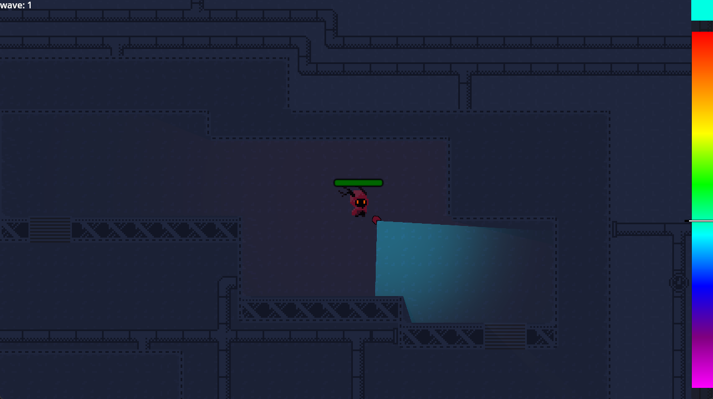
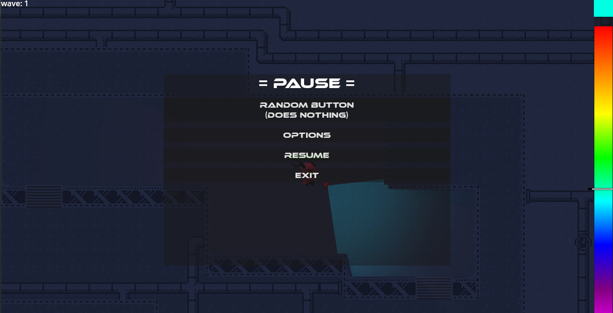

# Light Game

Ein **Topdown 2.5D Game**, bei dem du auf einer Map spawnst und gegen Gegner kämpfst, die in Wellen auftauchen und dich angreifen.

## Gameplay

Du hast ein **Licht**, dessen Farbe du anpassen kannst.  
Wenn die Farbe von deinem Licht mit der Farbe eines Gegners übereinstimmt und du ihn damit anleuchtest, stirbt der Gegner.

## Features

- **Wellen-System mit Gegnern**
- **Gegner nutzen Pathfinding, um den Spieler zu verfolgen**
- **"Colorwheel" für das Licht**
- **Topdown 2.5D Gameplay**
- **Pause-Menü**
- **Options-Menü**

